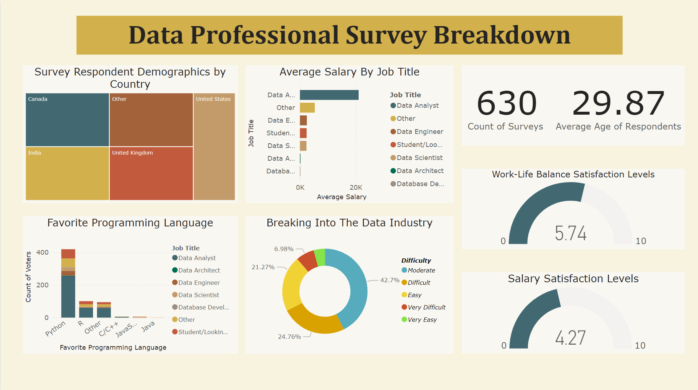
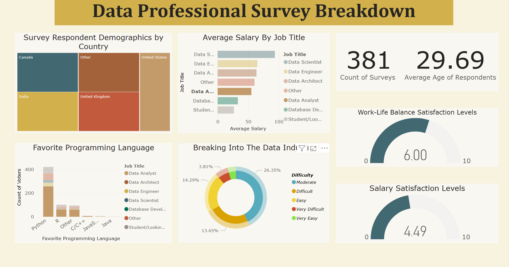
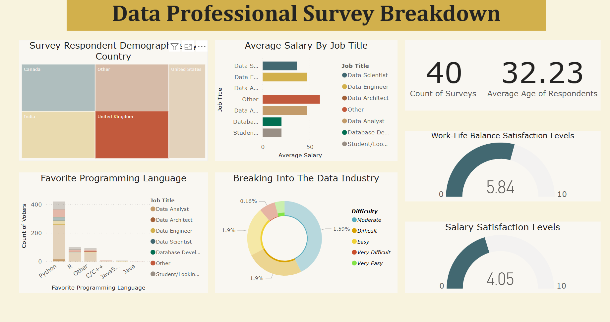

# 📊 Data Professional Survey Breakdown

This Power BI project explores data from over 3,000 data professionals worldwide, with a focus on salary trends, job satisfaction, roles, and regions. It aims to uncover key insights about the working lives of those in the data industry.

---

## 🎯 Project Goal

To visualize and analyze patterns in the data professional landscape, such as:
- Which roles earn the most?
- How does location affect salary?
- Are professionals satisfied with their jobs and pay?

---

## 🛠 Tools Used
- **Power BI** – Data modeling, DAX, dashboard building
- **Excel** – Data cleanup and preparation
- **GitHub** – Project hosting and portfolio sharing

---

## 📁 Files Included
- `Data Professional Survey Breakdown.pbix` – Final Power BI dashboard
- `dashboard_screenshots/` 
- `Summary.pdf` 

---

## 📈 Key Insights
- 💼 **Data Engineers** report the highest average salaries among roles analyzed.
- 🌍 Professionals in the **USA, UK, and Germany** had the highest earnings.
- 😊 Higher salary satisfaction strongly correlates with general job satisfaction.
- 🧠 Experience level plays a large role in salary variation across all job titles.

---

## 📷 Dashboard Previews

### 👤 Overview 

### 💼 Focus on Data Analysts

### 🌍 Salary Breakdown – United Kingdom

---

## 📚 What I Learned
- Improved Power BI DAX skills and dashboard layout design
- Learned how to structure multi-page reports for executive-level users
- Developed clearer storytelling using data visualization

---

## 🔗 Let’s Connect
- 💼 [LinkedIn Profile]((https://www.linkedin.com/in/cameren-philip-94a3641aa/))  
